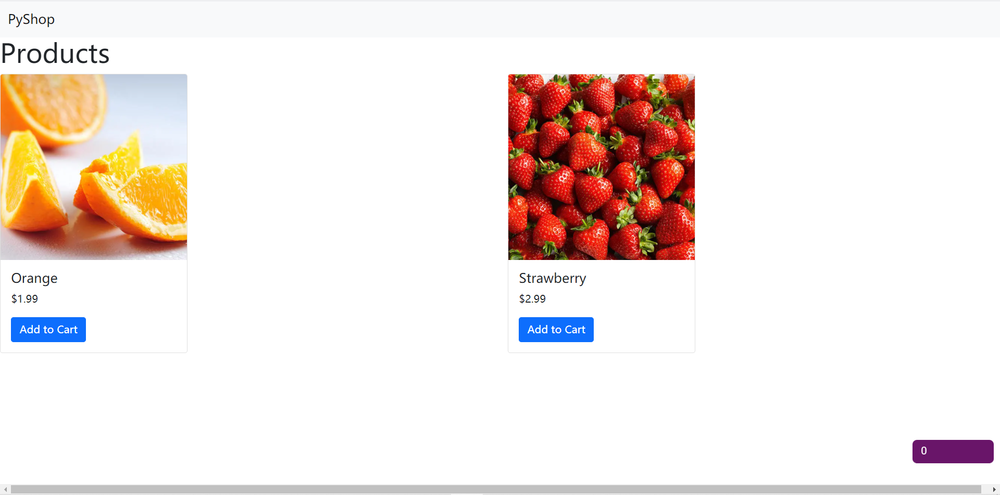
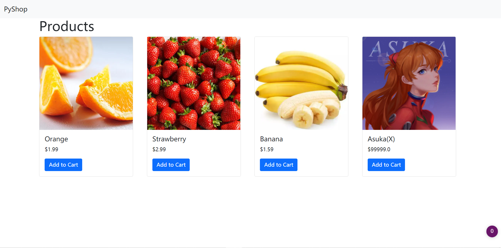
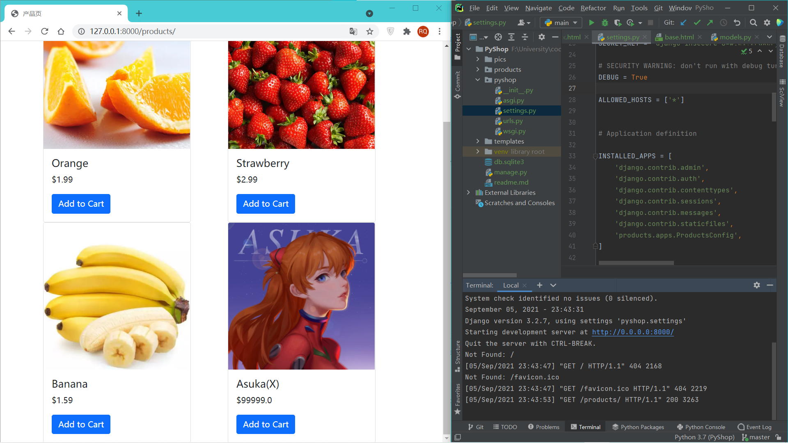

# Project 3: Building a Website with Django

[Django v3.2 文档](https://docs.djangoproject.com/zh-hans/3.2/)

## 创建自己服务器的简要步骤（官方文档版）

### 第 1 节：响应和请求

```python
pass
```

没看，嘿嘿

🎵*Never gonna give you up...*

## Mosh版

1.  安装 `Django`

   ```bash
   pip install django=={$version}
   ```

2. 创建项目

   ```bash
   django-admin startproject {$project_name} [{$path}]
   ```

3. 开启服务器（检查是否创建成功）

   ```bash
   python manage.py runserver
   # 在项目的根目录下
   ```

   \* 要映射到局域网上时：

   ```bash
   python manage.py runserver 0.0.0.0:8000
   ```

   并且在 *settings.py* 里设置

   ```python
   ALLOWED_HOSTS = ['*']
   ```

   

4. 创建应用

   ```bash
   python manage.py startapp {$app_name}
   ```

5.  创建 *View Functions*

    View function 就是当用户导航到某个页面时会被 Django 调用的函数

    用户输入URL -> 浏览器发送 HTTP Request -> Django 接收并发送给 View Function

    在 *views.py* 中创建 `index` 函数

    ```python
    def index(request):
        return HttpResponse('hello world')
    ```

6.  URL Mapping

    Map URL to function

    1. 在项目中创建 urls.py

    2. 编写 urls.py

       ```python
       from django.urls import path
       # 注意这里不可以写 import views
       # 可能会引用到错误的文件
       from . import views
       
       
       urlpatterns = [
           # empty string
           # representing the root of this app
           # /products
           # ↓ not calling index()
           path('', views.index)
       ]
       ```

    3. 在 `{$product_name}`文件夹中找到 *urls.py* ，添加引用，并在其中的 `urlpatterns` 列表添加映射：

       ```python
       from django.contrib import admin
       from django.urls import path, include
       
       
       urlpatterns = [
           path('admin/', admin.site.urls),
       	# -----------------------------------------    
           path('products/', include('products.urls'))
           # -----------------------------------------
       ]
       ```

7.  创建 Models

    在 `{$app_name}` 文件夹下的 *models.py* 中创建类：

    ```python
    class Products(models.Model):
        # CharField: 可以包含文本的字段
        name = models.CharField(max_length=255)
        price = models.FloatField()
        stock = models.IntegerField()
        image_url = models.CharField(max_length=2083)
    ```

8.  Migrations

    1. 安装 [*DB Browser for SQLite*](http://www.sqlitebrowser.org/) ，把项目中的 *db.sqlite3* 丢进去

    2. 在 `{project_name}` 文件夹下的 *settings.py* 中的 `INSTALLED_APPS` 列表中添加项目：

       ```python
       INSTALLED_APPS = [
           ...,
           'products.apps.ProductsConfig',
       ]
       ```

    3. 在终端输入 `python .\manage.py makemigrations`

       会在 `{app_name}/migrations` 文件夹下创建一个 *0001_initial.py*

    4. 在终端输入 `python .\manage.py migrate`

       会自动在数据库里创建表

9.  Admin

    1. 在终端创建管理员用户：

       ```bash
       python .\manage.py createsuperuser
       ```

       可以在管理员页面（127.0.0.1:8000/admin/）查看用户。

    2. 在 `{$app_name}` 文件夹中打开 *admin.py* ，添加代码，在管理页面设置产品

       ```python
       admin.site.register(Products)
       ```

       这时就可以在主页上添加产品了。

10.  Customizing the Admin

     在 *admin.py* 中添加：

     ```python
     class ProductAdmin(admin.ModelAdmin):
         list_display = ('name', 'price', 'stock')
     ```

     效果如图：

     

     同理可以按照以上步骤添加本例中另一个 Model: *Offer*

11. Templates

    Show users the products...

    1. 在 *products/views.py* 中添加：

       ```python
       from .models import Products
       ```

       并在 `index` 函数中添加语句来存储产品数据：

       ```python
       def index(request):
           # 获取所有产品
           products = Products.objects.all()
           ...
       ```

       

    2. 在 Products 文件夹中建立目录 ***Templates*** ，在里面创建 ***index.html***

    3. 让 `index` 函数返回 *index.html* ，并为页面传参，以便动态生成页面：

       ```python
       def index(request):
           ...
           # 字典用于传参
           return render(request, 'index.html',
                         {'products': products})
       ```

    4. *index.html* 内容：

       ```html
       <h1>Products</h1>
       <ul>
           
           <li>{{ product.name }} (${{ product.price }})</li>
           
       </ul>
       ```

       其中大括号括起来的东西是 *django* 的 ***templates tags*** 。

12. Adding Bootstrap

    [*Bootstrap官网*](https://getbootstrap.com/)

    大概就是整好看点...

    在官网的 Docs 里找到 ***Starter template*** ，复制里面的代码到 *templates/base.html* （模板文件）。要修改的内容就是 *index.html* 里的 `` 和两个文件都有的 ` ... `

13. Rendering Cards

    在 [*Bootstrap Docs*](https://getbootstrap.com/docs/) 里找到 ***Components*** 下的 [***Cards***](https://getbootstrap.com/docs/5.1/components/card/) ，然后复制示例代码

    太难描述了，看代码吧QwQ

    *Tips: 按 <kbd>Ctrl</kbd>+<kbd>Alt</kbd>+<kbd>L</kbd> 可以自动美化代码*

14. Final Touches

    添加导航栏 [***Navbar***](https://getbootstrap.com/docs/5.1/components/navbar/)

    流程差不多，就是用示例做一下。

    为了能重复用 *base.html* ，把它挪到根目录下的 *template* 文件夹下。为了让 django 知道这个文件的存在，要在 *pyshop/settings.py* 中的 `TEMPLATES` 列表里字典中找到 `'DIRS'` 列表，在里面加上文件目录，即：

    ````python
    TEMPLATES = [
        {
            ...
            'DIRS': [
                # 因为没有引用 os 所以这个没用
                # os.path.join(BASE_DIR, 'templates')
                Path.joinpath(BASE_DIR, 'templates')
            ],
            ...
        },
    ]
    ````

    现在的效果：

    

    可以看到左边是贴边的，非常难看。

    所以把 *base.html* 里的 *block* 部分丢进一个容器：

    ```html
    <div class="container">
      
      
    </div>
    ```

    

    最终效果：

    

    还有：

    

    不算很难看嘛！可以接受！

